# Hospital Management System

### Java Programming Mini Project · REVA University

<p align="center">
  <strong>R24SA005 · Arun Sharma</strong><br>
  B.Sc. (BSTCs) · Semester V · Java Programming
</p>

<p align="center">
  A console-based hospital management application demonstrating Java object-oriented programming, patient and doctor management, billing, department handling, and hospital statistics.
</p>

---

## Project Overview

The **Hospital Management System** is a menu-driven Java application that simulates basic hospital operations. It manages patient and doctor records, supports patient searches, calculates patient bills, demonstrates interface-based billing and dynamic method binding, and displays hospital statistics.

The project is designed as a Java programming mini project and demonstrates core object-oriented programming (OOP) concepts, including encapsulation, inheritance, abstraction, polymorphism, interfaces, method and constructor overloading, method overriding, static members, enumerations, arrays of objects, and custom packages.

The application uses four main components: `main`, `model`, `service`, and the Java standard library for console input/output. The current implementation stores records in arrays during the running session; persistent database storage is not documented.

## Features

| Feature | Description |
|---|---|
| Patient registration | Registers patients with personal details, department, admission duration, and emergency status. |
| Doctor registration | Registers doctors with personal details, specialization, experience, department, and salary. |
| Patient listing | Displays registered patients and their details. |
| Doctor listing | Displays registered doctors, their specializations, experience, and seniority levels. |
| Patient search | Searches for a patient by full or partial name, ignoring letter case. |
| Department handling | Uses a `Department` enum for Cardiology, Neurology, Orthopedics, Pediatrics, and General. |
| Patient billing | Calculates bills using admission days, consultation fees, extra charges, emergency surcharge, and service tax. |
| Payable interface | Demonstrates billing through the `Payable` interface and a formatted receipt line. |
| Dynamic binding | Displays patients and doctors through references of the abstract `Person` class. |
| Hospital statistics | Displays the total number of persons, patients, doctors, and menu screens shown during the session. |
| Input handling | Reads console input and handles invalid integer or decimal input with fallback values. |
| Sample data | Loads example patient and doctor records when the application starts. |

## Application Screenshots

The screenshots below show the application running in the Java console. Each pair is arranged side-by-side to make the feature walkthrough easier to scan.

<table>
  <tr>
    <td width="50%" valign="top">
      <h3>01 · Main Menu</h3>
      <p>The main menu provides access to hospital operations.</p>
      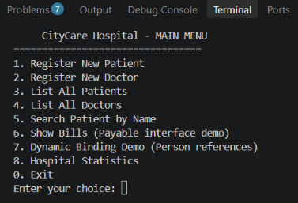
    </td>
    <td width="50%" valign="top">
      <h3>02 · Patient Registration</h3>
      <p>Registers a patient and displays the generated patient ID.</p>
      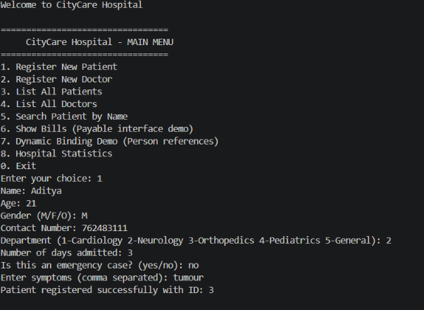
    </td>
  </tr>
  <tr>
    <td width="50%" valign="top">
      <h3>03 · Doctor Registration</h3>
      <p>Collects doctor details and registers a doctor.</p>
      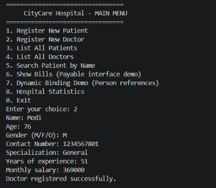
    </td>
    <td width="50%" valign="top">
      <h3>04 · Patient List</h3>
      <p>Displays registered patients and their information.</p>
      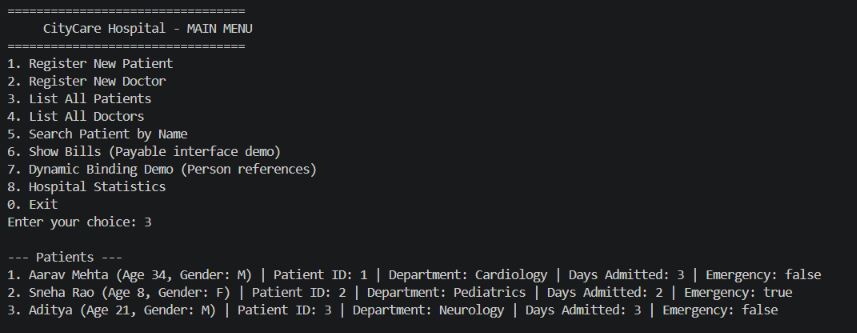
    </td>
  </tr>
  <tr>
    <td width="50%" valign="top">
      <h3>05 · Doctor List</h3>
      <p>Displays doctors, specializations, departments, and experience levels.</p>
      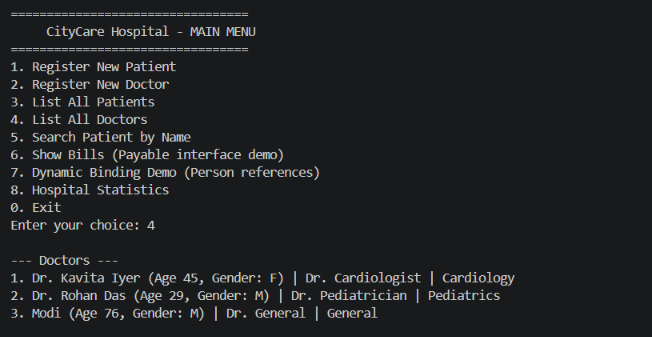
    </td>
    <td width="50%" valign="top">
      <h3>06 · Patient Search</h3>
      <p>Searches for a patient using a full or partial name.</p>
      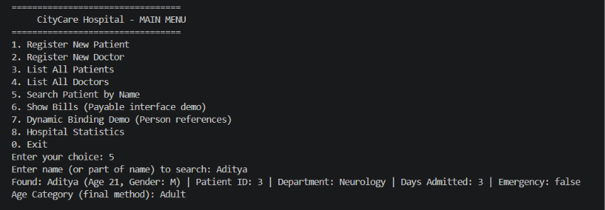
    </td>
  </tr>
  <tr>
    <td width="50%" valign="top">
      <h3>07 · Patient Bills</h3>
      <p>Displays patient bills, rounded bill amounts, and total hospital revenue.</p>
      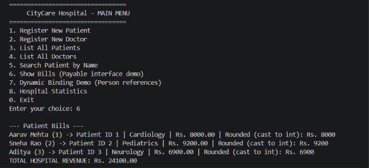
    </td>
    <td width="50%" valign="top">
      <h3>08 · Dynamic Binding</h3>
      <p>Shows patient and doctor objects through `Person` references.</p>
      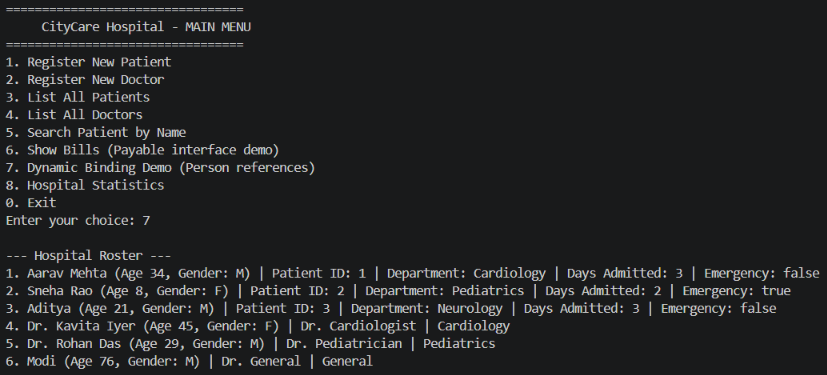
    </td>
  </tr>
  <tr>
    <td width="50%" valign="top">
      <h3>09 · Hospital Statistics</h3>
      <p>Displays person, patient, doctor, and menu-screen counts.</p>
      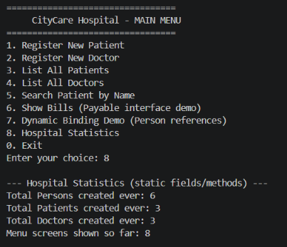
    </td>
    <td width="50%" valign="top">
      <h3>10 · Exit</h3>
      <p>Displays the closing message when the application exits.</p>
      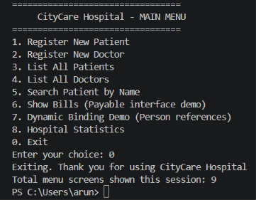
    </td>
  </tr>
</table>

## Data Flow Diagram

The following flowchart summarizes the documented application workflow. It is a conceptual representation of the current console application.

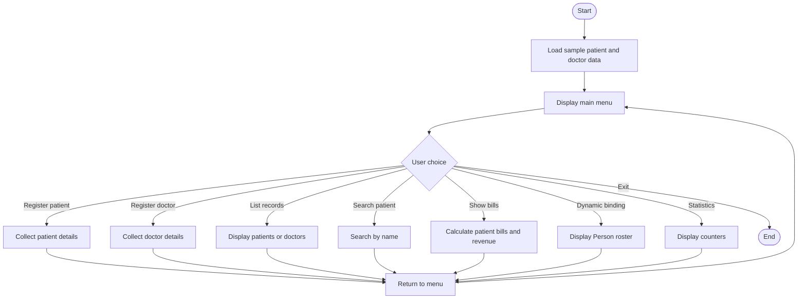

## UML Class Structure

The following Mermaid diagram summarizes the main class and interface relationships.

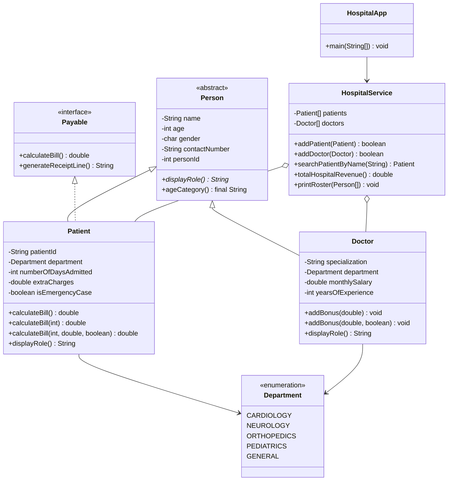

## Project Structure

```text
R24SA005_ARUN_SHARMA_JavaProject/
├── README.md
├── Report_README.docx
├── RUN_IN_VSCODE.md
├── run.bat
├── sample_output.txt
├── pom.xml
├── .project
├── .classpath
├── .settings/
├── .vscode/
│   ├── launch.json
│   └── settings.json
└── src/
    └── com/
        └── hospital/
            ├── main/
            │   └── HospitalApp.java
            ├── model/
            │   ├── Department.java
            │   ├── Doctor.java
            │   ├── Payable.java
            │   ├── Patient.java
            │   └── Person.java
            └── service/
                └── HospitalService.java
```

## Object-Oriented Programming Concepts Demonstrated

| Concept / Requirement | Project implementation |
|---|---|
| Encapsulation | Private fields and public accessors in model classes. |
| Data types and variable scope | `String`, `int`, `char`, `double`, `boolean`, instance variables, local variables, and static variables. |
| Constants and `final` | `Person.HOSPITAL_NAME`, department and ID constants, and the final `ageCategory()` method. |
| Operators and precedence | Arithmetic in patient billing, including room charges, consultation fees, extra charges, and emergency surcharge. |
| Type conversion | Explicit narrowing cast from `double` to `int` in `getRoundedBillAmount()`. |
| Enumerations | `Department` enum with department-specific consultation fees. |
| Control flow | `if-else`, `switch`, `for`, `while`, enhanced `for`, and `do-while`. |
| Jump statements | `break`, `continue`, and `return`. |
| Arrays of objects | `Patient[]` and `Doctor[]` in `HospitalService`. |
| Console I/O and formatting | `Scanner`, `System.out`, `printf()`, and `String.format()`. |
| Constructor overloading | No-argument and parameterized constructors in `Person`, `Patient`, and `Doctor`. |
| Method overloading | `Patient.calculateBill()` variants and `Doctor.addBonus()` variants. |
| Static members | Counters for persons, patients, doctors, and menu visits. |
| `this` keyword | Field/parameter disambiguation and constructor chaining. |
| `super` keyword | Parent constructor calls and `super.toString()` in subclasses. |
| String methods | `trim()`, `split()`, `contains()`, `toLowerCase()`, and case-insensitive comparisons. |
| Inheritance | `Person` is the abstract base class of `Patient` and `Doctor`. |
| Polymorphism and dynamic binding | Overridden methods called through `Person` references. |
| Abstract class and method | Abstract `Person` class and abstract `displayRole()` method. |
| Interface | `Patient` implements `Payable`; billing is accessed through interface references. |
| Object method overriding | `toString()` and `equals()` implementations. |
| Custom packages | `com.hospital.model`, `com.hospital.service`, and `com.hospital.main`. |

## Important Source Files

- **Application entry point:** [`HospitalApp.java`](src/com/hospital/main/HospitalApp.java)
- **Abstract base class:** [`Person.java`](src/com/hospital/model/Person.java)
- **Patient model and billing:** [`Patient.java`](src/com/hospital/model/Patient.java)
- **Doctor model:** [`Doctor.java`](src/com/hospital/model/Doctor.java)
- **Department enumeration:** [`Department.java`](src/com/hospital/model/Department.java)
- **Billing interface:** [`Payable.java`](src/com/hospital/model/Payable.java)
- **Hospital operations:** [`HospitalService.java`](src/com/hospital/service/HospitalService.java)
- **Sample console run:** [`sample_output.txt`](sample_output.txt)
- **VS Code run instructions:** [`RUN_IN_VSCODE.md`](RUN_IN_VSCODE.md)

## Compile and Run

The project includes a Maven configuration targeting **Java 17**. Use a compatible JDK.

### Windows

You can run `run.bat` from the extracted project folder, or use PowerShell:

```powershell
javac -d bin src\com\hospital\model\*.java src\com\hospital\service\*.java src\com\hospital\main\*.java
java -cp bin com.hospital.main.HospitalApp
```

### macOS / Linux / Git Bash

Run these commands from the project root:

```bash
mkdir -p bin
javac -d bin $(find src -name "*.java")
java -cp bin com.hospital.main.HospitalApp
```

### Visual Studio Code

1. Extract the ZIP file.
2. Open the project folder containing `src` and `.vscode`.
3. Install the **Extension Pack for Java** if it is not already installed.
4. Open `src/com/hospital/main/HospitalApp.java`.
5. Click **Run**, or use the configured Run and Debug option.

The application loads example records at startup. New records are held in memory for the current run; database or file-based persistence is not included in the documented implementation.

## Sample Console Output

A captured sample run is provided in [`sample_output.txt`](sample_output.txt). It demonstrates patient and doctor listing, patient search, patient registration, dynamic binding, billing, hospital statistics, and application exit.

## Submission Checklist

- [x] Java source organized into custom packages
- [x] Patient and doctor registration and listing
- [x] Patient search by name
- [x] Patient bill calculation and total revenue
- [x] Department enum and consultation fee handling
- [x] Dynamic binding through `Person` references
- [x] OOP concepts mapped to source files
- [x] UML class diagram included
- [x] Data flow diagram included
- [x] Compilation and execution instructions included
- [x] Sample console output included
- [x] Application screenshots included and referenced in this README

---

<p align="center">
  <sub>Java Programming Mini Project · REVA University · R24SA005</sub>
</p>
